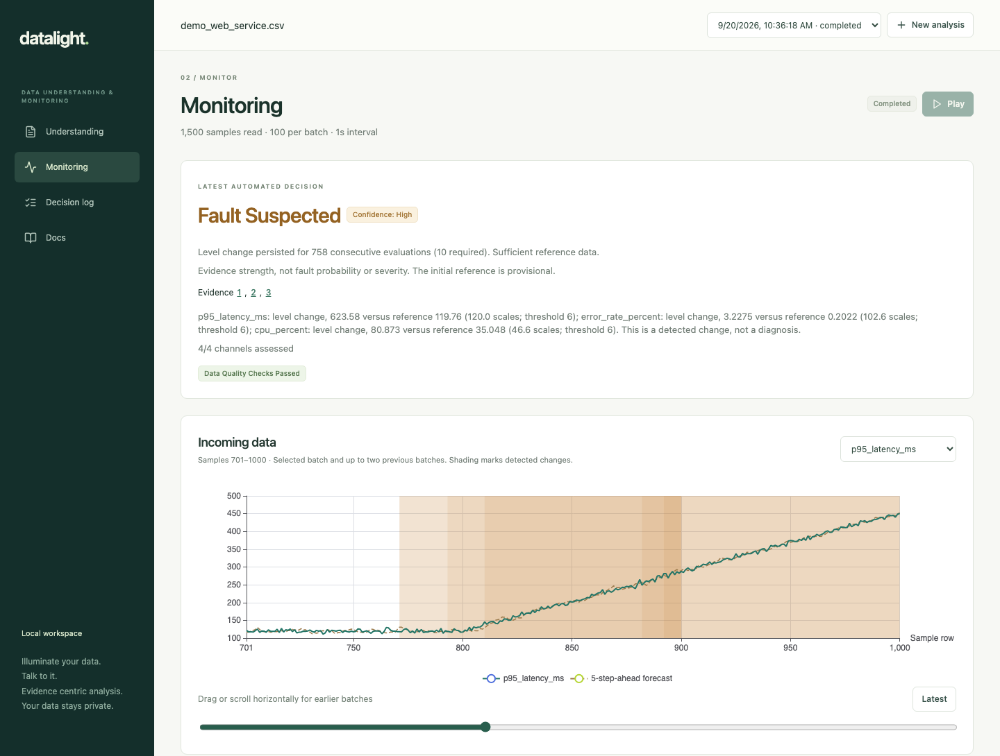
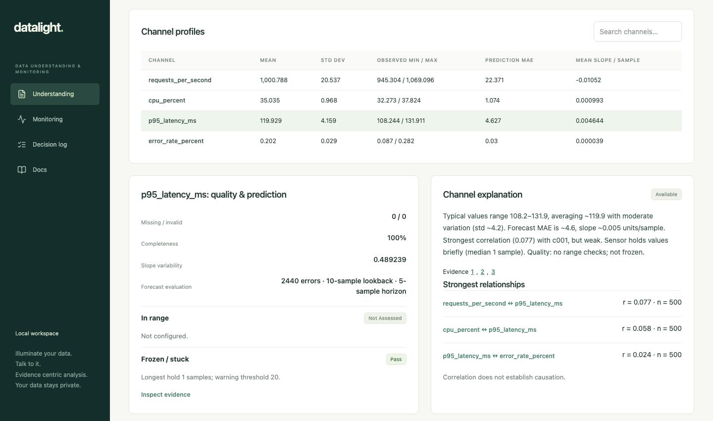
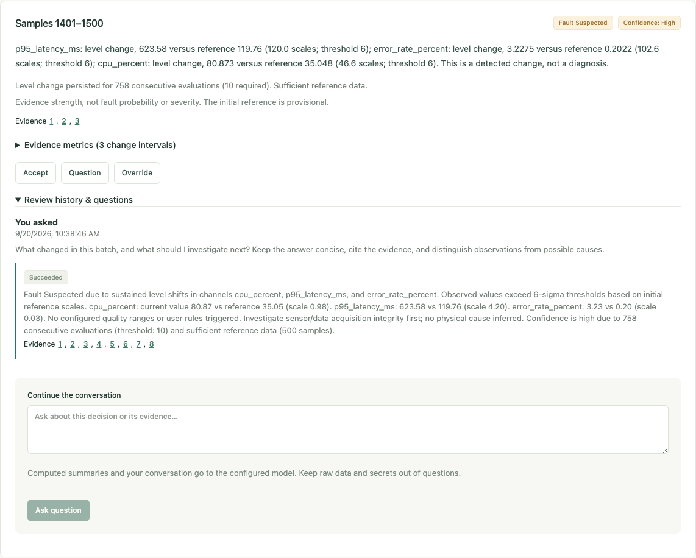

<p align="center">
  
</p>

Datalight is a local CSV data-understanding and monitoring application for the [Norrin challenge](Norrin_Hackathon_Challenge_Sep_2026.pdf). Choose a file, build an initial understanding report, then press Play to replay the remaining observations in batches. Computed evidence and human reviews remain traceable.

[Quickstart](#quickstart) · [Demo screenshots](#a-look-inside) · [Privacy](#privacy-and-optional-ai)

The [Tennessee Eastman export](docs/DATASET.md) is the primary testbed. Its labels, channel identities, ranges and fault catalogue are offline context, never detector inputs or model knowledge. The product's source-convention portability limits remain explicit in the [roadmap](docs/roadmap.md).

## A look inside

Actual app screenshots using the included [synthetic web-service demo](docs/SECOND_DOMAIN_DEMO.md), with optional AI enabled. Click any image for a closer look.

**Watch a change unfold.** Replay observations, compare measurements with short-term forecasts, and inspect flagged intervals. Here, latency drifts upward; the latest decision explains its evidence strength while the chart shows an earlier window.

[](docs/screenshots/monitoring.png)

**Understand before you monitor.** Explore channel statistics, quality checks, forecast error, relationships, and an AI explanation linked to the underlying evidence.

[](docs/screenshots/understanding.png)

**Ask why. Keep the evidence.** Discuss a flagged batch with the AI assistant, follow its citations, and accept, question, or override the decision. The original finding remains in the history.

[](docs/screenshots/evidence-review.png)

## Quickstart

You need Docker running with Compose, `make`, and about 4 GB of available memory. No Python, Node, data download, or model key is needed for the included synthetic demo. To also try AI explanations, questions and rule proposals, follow the [optional model setup](docs/demo-setup.md#enable-model-explanations-questions-and-rules) before starting.

**1. Start the app.** In the `datalight` repository folder, run:

```bash
make demo
```

This builds and starts the services, runs database migrations, and waits for service health. The first build takes a few minutes. Wait for **Ready: http://localhost:8080**, then open [Datalight](http://localhost:8080). Prepared files in `runtime/demos` are selected when available; otherwise the included synthetic demos are ready to use.

**2. Build a report.** Click **New analysis** and select **demo** (synthetic), or **demo abrupt** if prepared presentation files are available. Use **500** initial samples and **100** samples per batch. Set the interval to **1 second** for a faster presentation (the default is 10 seconds), then click **Build understanding report**. Playback starts paused.

**3. Inspect the evidence.** Read **Understanding** for quality checks, statistics, correlations and prediction results. Optionally exclude channels and click **Save monitoring setup**. Open **Monitoring**, press **Play**, and inspect a flagged batch's evidence and confidence basis. Channel selection and applied rules lock at first Play.

**4. Review a decision.** Open **Decision log** to accept or override a decision with a reason. With a model configured, ask a question and inspect its evidence citations. Reviews preserve the original automated conclusion. Open **Docs** for metric definitions and detection criteria.

To stop while keeping history, run `docker compose stop`. For restarts, alternate ports, Docker contexts or your own data directory, see [startup options and troubleshooting](docs/demo-setup.md#restart-stop-and-troubleshoot).

## Try your own data or a second domain

Choose **New analysis → Upload CSV** for a UTF-8 CSV with a header row and numeric data (up to 256 MiB by default). Use more rows than the initial window to leave observations for playback.

For a second-domain example, upload the included [synthetic web-service CSV](tests/fixtures/demo_web_service.csv) and use the same **500 / 100 / 1 second** settings. Traffic stays stable while CPU, latency and errors rise; the same detector finds changes without domain-specific code. The [walkthrough](docs/SECOND_DOMAIN_DEMO.md) covers expected evidence, optional reviewed rules and evidence-citing questions, and the limits of causal interpretation.

If you have the Tennessee Eastman export, the [presentation-data guide](docs/demo-setup.md#prepare-the-three-presentation-demos) prepares three complete-run examples: abrupt change, sustained drift and broad multichannel change. This is optional; the quickstart works without downloading data.

## Understanding and monitoring

- **Quality:** completeness and invalid counts, user-configured bounds, and possible frozen behavior. Unspecified bounds are “Not configured.” Stuck warnings require a hold of at least 20 samples or five times the initial typical completed hold, whichever is larger. A constant initial channel is explicitly inconclusive.
- **Statistics:** mean, standard deviation, observed minimum/maximum, strongest Pearson relationships with paired counts, and an expandable full correlation matrix.
- **Prediction:** per-channel least-squares trend lines on 10 preceding samples forecast the next 5. The report gives chronologically evaluated MAE, signed mean slope and slope variability. Slopes are units per sample, never units per playback second.
- **Change detection:** adjacent 10-sample mean differences, persistent 50-sample slopes, and fixed-reference level deviations. Temporal rules and reference scales are fixed from the initial window. Windows never bridge invalid values, configured-range violations, ordering gaps or independent runs.
- **Monitoring:** the latest three batches of sample-level values and five-step-ahead forecasts, with flagged intervals. Scroll horizontally to retrieve older batches; Latest returns to live playback. Each batch has one **OK / Fault Suspected** decision and a separate quality warning. OK means no process rule triggered; insufficient coverage appears prominently beside it.
- **Confidence:** suspected-fault decisions include Low/High evidence strength with a recorded basis and evidence links. Confidence is not fault probability or severity.
- **Review:** accept, question or override each batch decision. Overrides specify a status and reason; the latest human assessment is shown beside the preserved automated conclusion. Questions receive asynchronous LLM answers when configured, with follow-up conversation context. Reviews require no name field. Reviews never recalibrate thresholds.

Uploaded files use file row order; prepared demos retain their sample-reset boundaries. Recognized evaluation metadata and sample columns are unavailable as detector inputs. Numeric columns are inferred from the initial window; text columns are not monitored. A short file may be fully consumed by the initial report.

Natural-language rules use the configured model to propose one threshold, outside-range, or missing-value check. Review the exact channel, condition and fault/quality effect before Apply. Only applied rules run, using deterministic checks with linked evidence. Channel exclusions and rules lock at first Play. Rules do not change the initial reference or existing quality-limit masking.

The reference is provisional. A statistical change is not a fault diagnosis, and a repeated value is not by itself a proven sensor failure. See [architecture](docs/architecture.md) for exact rules, persistence, and model boundaries.

## Privacy and optional AI

Raw observations stay local. Optional model calls receive typed computed summaries and sanitized questions or rule requests with opaque channel IDs. Original column names and evaluation labels are excluded; do not put raw data or secrets in questions. Provider credentials remain backend-only.

Deterministic monitoring and human reviews work without a model. When enabled, AI adds initial explanations, evidence-citing conversations and rule proposals that require review before Apply. Model outages leave these features visibly unavailable or partial and do not stop monitoring. See [model setup and data boundaries](docs/demo-setup.md#enable-model-explanations-questions-and-rules).

## Development and validation

For native development, use Python 3.12, uv, Node 24 and pnpm 11.19.0. Locked dependencies are committed. The [development guide](docs/development.md) covers installation, separate services, `make check`, database/browser tests and API type generation.

See [current state](devlog/current.md) for recorded verification, [architecture](docs/architecture.md) for implementation details, [decisions](devlog/decisions.md) for durable choices, and [roadmap](docs/roadmap.md) for coverage gaps and future work.
