# Architecture

## Data flow

```mermaid
flowchart LR
  CSV[Read-only mounted CSV] --> Reader[Bounded record reader]
  Reader --> Quality[Quality checks]
  Quality --> Profile[Profiles and reference deviation]
  Profile --> DB[(PostgreSQL evidence and audit)]
  DB --> API[FastAPI]
  API --> UI[React operator workspace]
  UI --> Review[Append human review]
  Review --> DB
  Profile --> Summary[Typed aggregate allowlist]
  Summary --> Model[Configured compatible model]
  Model --> Validate[Schema and evidence validation]
  Validate --> DB
```

## Services and ownership

Nginx serves the Vite production build and proxies `/api`. FastAPI exposes versioned REST resources and an SSE notification stream. The worker has separate replay and interpretation loops, so a slow model does not block ingestion. PostgreSQL owns runs, leased jobs, batch checkpoints, profiles, correlations, findings, reviews, events, and model-call history. A one-shot Compose service applies Alembic migrations before workers/API start.

The analysis module takes bounded in-memory data and returns deterministic results. It does not use HTTP, database sessions, or model clients. Ingestion strips evaluation values before analysis. The source adapter currently recognizes the supplied metadata fields; a future domain adapter can classify different metadata without changing the core profiler, review, or provider contracts.

## Replay and recovery

Startup uses a database advisory lock to register one initial run. A unique source fingerprint combines size, modification time, inode, and hashes of the first/last 64 KiB. This is a practical replacement check, **not a cryptographic hash of the entire dataset**. Input is assumed static for a replay; append/change requires an explicit new analysis. Reopening the browser is read-only.

The CSV reader uses complete records, including quoted newlines. Byte offsets are 64-bit and recorded only at record boundaries. Initial windows may contain several sequences; temporal features exclude transitions. Subsequent batches stop at a reset to sample 1. Other backward indices, duplicates, and gaps are quality findings. With no sample column, ordering uses file order and sequence checks are unavailable.

Jobs are claimed using `FOR UPDATE SKIP LOCKED`, a five-minute lease, and a token. Run locks serialize batch publication with controls. Evidence, findings, the batch summary, audit event, and next cursor commit in one transaction. A stale worker token cannot publish another worker's claim. PostgreSQL triggers prohibit updates/deletes to batches, evidence, findings, reviews, and audit events. This protects application history; it is not protection against a database administrator.

Pausing leaves a run resumable. A new analysis stops the active replay and retains previous runs. EOF completes the run. A missing, malformed, or replaced source fails visibly. Fast-forward changes pacing only, never batch composition, thresholds, or data selection.

## Evidence and statistical limits

Each numeric profile has a stable evidence ID tied to its run/batch. Valid observations supply quantiles, mean, standard deviation, median/MAD, successive-difference variation, lag-1 correlation, and equal-value hold lengths. Pairwise correlations include paired counts and reasons when undefined. None of these establishes a physical instrument identity.

Channel eligibility requires at least 32 valid values, at most 5% missing/invalid values, and no malformed records in that window. The deviation detector requires both eligible batch and reference profiles plus positive reference MAD. It compares batch medians to the fixed initial reference with threshold 6. Small final batches, constant references, and unreliable channels are reported as unsupported. Partially usable batches retain explicit quality status.

Physical range, unit consistency, wall-clock timeliness, and validated stuck-sensor checks are explicitly unavailable. Regular holds of two or five samples are evidence about cadence, not sensor failure. Initial normality is an assumption even when the dataset's hidden labels happen to say normal.

## Model boundary

Only `SummaryPayload` leaves the environment: opaque channel IDs, profiles with at least 32 observations, up to 20 aggregate correlations, an optional selected deviation with reference statistics, evidence IDs, and a fixed provisional-reference statement. Raw rows, time series, original names, evaluation values, and API credentials are absent from the body. Credentials go only in the authorization header to the configured endpoint; redirects are disabled.

Each attempt records its exact outgoing body, purpose, endpoint/model, response or failure, and timestamps. An interrupted request is labeled outcome-unknown before retry; exactly-once external execution is not promised. The adapter accepts JSON or one complete JSON code fence, then validates shape, unique channel hypotheses, and evidence membership. A selected deviation must cite both current and reference profiles. Reference validation does **not** prove the model's interpretation correct; the operator still reviews a tentative hypothesis.

Provider failures leave the deterministic report available. At most two ordinary requests are queued per run: initial role hypotheses and interpretation of the first detected deviation. Separate worker loops keep both off the replay path. No model call runs on every batch. Local or EU-hosted compatible providers are configuration choices; the exact Norrin model ID comes from its `/v1/models` response; live completion verification is recorded in the devlog. This deployment has no analytics/CDN calls or external fonts.

## Interfaces

`/api/v1/system` discovers source/current run. Run resources provide config/status, report, recent/paginated batches, findings, model calls, and audit history. Controls pause/resume or change playback speed. Reviews target a finding and append accept/question/override records. Evidence is fetched by ID. SSE sends durable event IDs and supports `Last-Event-ID`; REST remains authoritative. OpenAPI generates the browser's TypeScript contracts.

The initial deployment has one active replay, a trusted local operator, and self-declared reviewer names. Authentication, tenants, adaptive feedback, remote streaming, and retention policies are future decisions.
